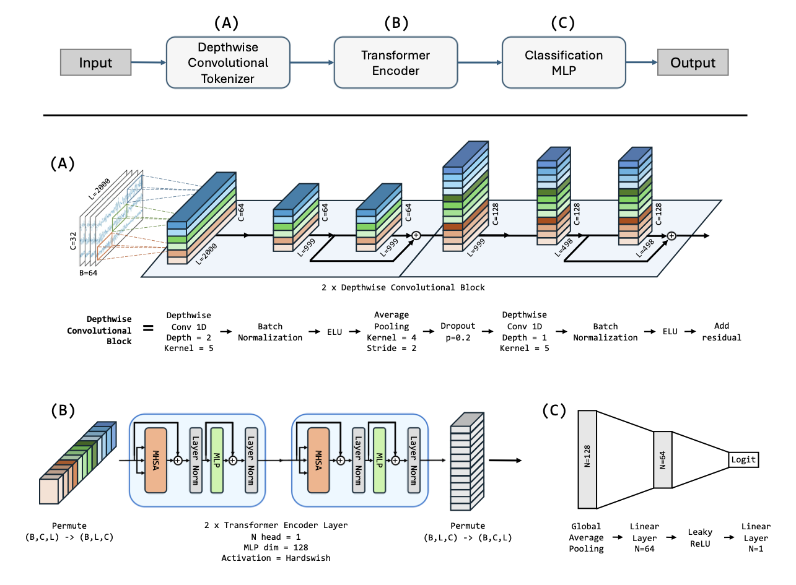
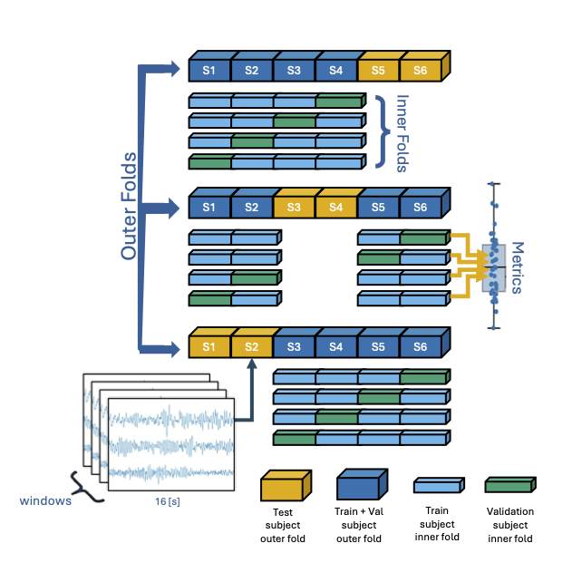
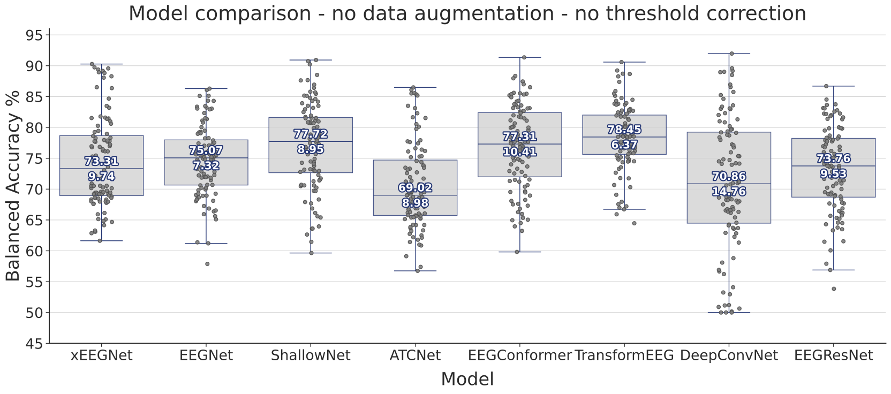
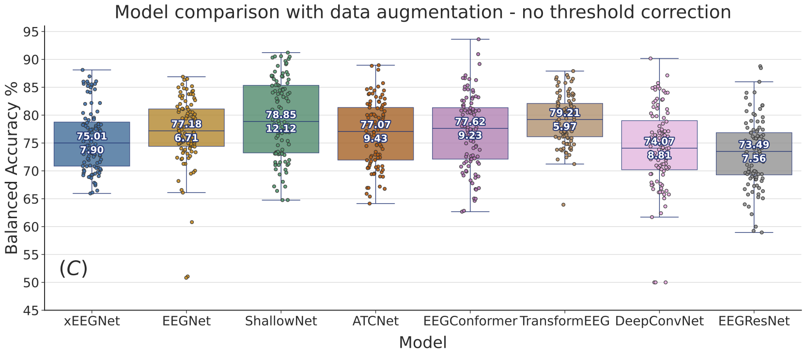

# TransformEEG: Parkinson's Disease Detection with EEG data

This is the official repository for the research paper 

    TransformEEG: Towards Improving Model Generalizability in
    Deep Learning-based EEG Parkinson's Disease Detection

Submitted to Neurocomputing.

In this work, we propose TransformEEG, a hybrid Convolutional-Transformer
designed for PD detection using EEG data.
Unlike transformer models based on the EEGNet structure,
TransformEEG incorporates a depthwise convolutional tokenizer.
This tokenizer is specialized in generating tokens composed
by channel-specific features, which enables more effective feature mixing
within the self-attention layers of the transformer encoder.

## How was the model evaluated

The paper describes in the detail the experimental methodology. 
Here, we report a brief description of the key points.

## Data Preprocessing

To preprocess the selected datasets, we recommend reading and following the instructions in the [docs](https://github.com/MedMaxLab/eegprepro/blob/main/docs/2_DataPreparation.md) file.
These instructions explain how to download datasets from OpenNeuro and preprocess them with BIDSAlign.

### Model architecture

The architecture of the model is schematized in the following figure.  
A pytorch implementation can be found in the ``AllFnc/models.py`` file.

  

  

### Model Evaluation

To evaluate the proposed model, four public datasets comprising 290 subjects
(140 PD patients, 150 healthy controls) were harmonized and aggregated.
A 10-outer, 10-inner Nested-Leave-N-Subjects-Out (N-LNSO) cross-validation
was performed to provide an unbiased comparison against seven other
consolidated EEG deep learning models.

The list of EEG-DL models included in the comparison, sorter by their number of learnable parameters in
ascending order, is reported below.

* **xEEGNet**
* **EEGNet**
* **ShallowNet**
* **ATCNet**
* **EEGConformer**
* **DeepConvNet**
* **EEGResNet**

The following figure schematizes the N-LNSO CV procedure.

  

### Results

Results are presented in the paper.

1) Model comparison with a basic pipeline without data augmentation

  

2) Model comparison with a pipeline that includes an optimal selected data augmentation

  

## Provided code

The scripts used to generate the results presented in the paper
are available in this repository, which is derived from the following
[GitHub repo](https://github.com/MedMaxLab/eegprepro)
associated with another study we published.

## Results

Performance metrics of each trained model are collected and organized in
the **ResultsTable.csv** file.
Due to the large number of training instances, model weights and results are not directly stored in this repository.
We plan to release them in zenodo.

## Authors and Citation

If you find the codes and results useful for your research,
Please consider citing our work.
It would help us continue our research.

The current version of the paper is available on [Arxiv](https://doi.org/10.48550/arXiv.2507.07622).

Contributors:

- Federico Del Pup
- Riccardo Brun
- Filippo Iotti
- Edoardo Paccagnella
- Mattia Pezzato
- Sabrina Bertozzo
- Andrea Zanola
- Louis Fabrice Tshimanga
- Prof. Hennning Müller
- Prof. Manfredo Atzori

## License

The code is released under the MIT License
